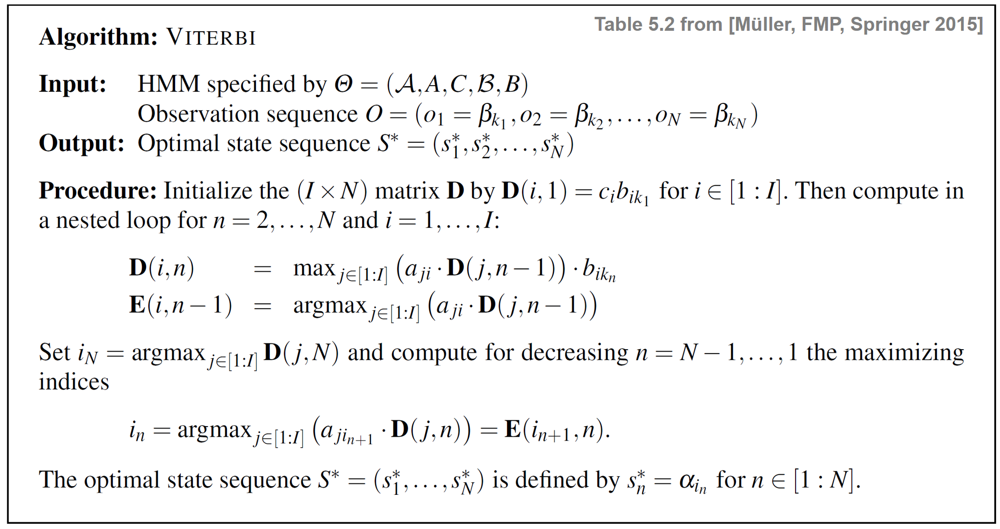

# POSTagging-Viterbi
POS Tagging on a Persian dataset with HMM (Viterbi Algorithm)

## Overview

Explore the world of Part-of-Speech (POS) tagging with the Viterbi Algorithm in this repository, which showcases Iman Kianian's work for Homework 3 in Natural Language Processing (NLP). The central focus of this project is implementing POS tagging on a given dataset using the powerful Viterbi Algorithm.

## Repository Structure

- **Iman Kianian _ NLP _ HW3.ipynb**: Jupyter notebook containing the implementation of POS tagging with the Viterbi Algorithm.
- **README.md**: Initial commit information and repository overview.
- **Report.pdf**: PDF document summarizing the methodology, experiments, and results of POS tagging using Viterbi.
- **Test.txt**: Test dataset used for evaluating the POS tagging model.
- **Train.txt**: Training dataset employed for developing the Viterbi-based POS tagging model.

## Usage

- Dive into the Jupyter notebook, "Iman Kianian _ NLP _ HW3.ipynb," for a detailed exploration of POS tagging using the Viterbi Algorithm.
- Reference the accompanying PDF report, "Report.pdf," for a comprehensive overview of the methodology and findings.
- Leverage the provided "Test.txt" and "Train.txt" datasets for hands-on experimentation with POS tagging.

## Contributions

Contributions to this repository are encouraged. Feel free to submit pull requests for improvements, bug fixes, or additional features related to POS tagging using the Viterbi Algorithm.

## License

This project is under the [MIT License](LICENSE), allowing you to use, modify, and distribute the code and materials for personal or commercial purposes.

If you have any questions or need further clarification, please feel free to reach out. Happy tagging!
